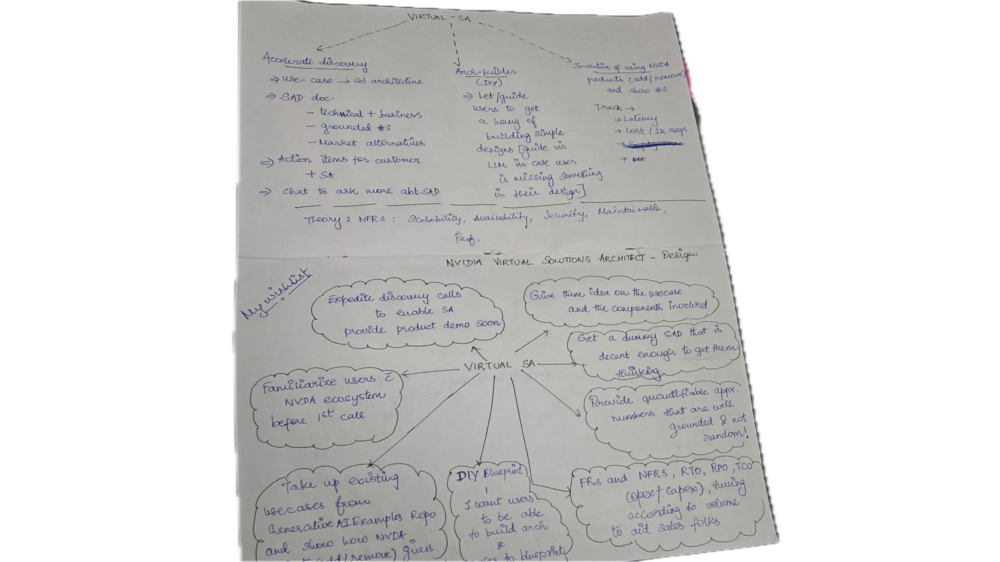

# NVArchitect — NVIDIA Virtual Solutions Architect

> **Expedite discovery calls. Enable every sales rep to think like an SA — before the first customer conversation.**

NVArchitect is an AI-powered tool that generates production-grade Solution Architecture Documents (SADs), architecture diagrams, competitive comparisons, and ROI simulations — all from a single plain-English prompt. Built for NVIDIA's partner ecosystem. Powered by **NVIDIA NIM (Llama-3.3-70B)**.

---

## 🎯 The Problem

Discovery calls are the highest-leverage moment in enterprise AI sales. But:
- **SAs are bottlenecked** — there aren't enough of them for every partner conversation
- **Sales reps lack technical depth** to have architecture-level discussions early on
- **Customers need to see value fast** — generic slides don't cut it for AI-savvy buyers
- **Partners need proof points** — quantifiable metrics, not marketing claims

## 💡 The Solution

NVArchitect gives every sales rep and partner **a sneak peek into the SA's brain** — generating:

1. **Draft architecture diagrams** tailored to the customer's use case
2. **Solution Architecture Documents** with NFRs, data flow, security, cost breakdown
3. **NVIDIA vs Market comparison** (honest competitive positioning for each product)
4. **ROI simulations** with live A/B comparison against non-NVIDIA alternatives

All grounded in NVIDIA's core values: **intellectual honesty**, **innovation**, and **agility**.

---

## 🏗️ Features

### 1. Discovery Accelerator
Describe any AI use case in plain English. In seconds, get:
- **Multi-variant architecture** (e.g., Cloud-Optimized vs Self-Hosted)
- **SAD with 7 sections**: Executive Summary, Assumptions, NFRs, Data Flow, Security, Operations, Cost Breakdown
- **NVIDIA vs Market**: For each NVIDIA product used, see market alternatives and NVIDIA's specific edge
- **SA Questions**: Discovery call questions that unlock the SA's unique expertise
- **Scoped Chat**: Ask follow-up questions within the context of the generated architecture

#### Architecture Self-Critique (Rule 1)
The LLM is instructed to **drop components that don't serve a specific purpose** for the use case. A coding agent won't get embeddings or vector DBs — only components with a defensible reason to exist.

### 2. ROI Simulator
5 pre-built industry scenarios (Healthcare, FinTech, Retail, DevOps, Legal) with:
- **Toggle NVIDIA solutions** and watch live business metrics update
- **A/B compare** against non-NVIDIA alternatives (OpenAI, AWS, Datadog, GitHub Copilot, etc.)
- **See the delta in real numbers** — latency, cost, safety, throughput, compliance
- **ROI projection** — annual savings, cost reduction %, time to ROI

---

## 🧠 Design Philosophy

This tool was built with these principles from NVIDIA's culture:

| Principle | How it's applied |
|---|---|
| **Intellectual Honesty** | LLM never hallucinate metrics. Alternatives are honestly compared — if a competitor is better in one dimension, we say so. |
| **Innovation** | State-of-the-art architecture patterns, not legacy templates. Self-critique ensures cutting-edge solutions. |
| **Agility** | Lean architectures that ship fast. 3 well-chosen components > 7 loosely coupled ones. |
| **Partner-First** | Built for the partner ecosystem — helps sales reps, SEs, and partners have informed conversations. |

---

## 🔧 Tech Stack

- **Frontend**: React 18 + TypeScript + Vite
- **LLM Backend**: NVIDIA NIM (Llama-3.3-70B) via NIM API
- **Styling**: Vanilla CSS with NVIDIA design tokens
- **Deployment**: Vercel (with serverless API proxy)

## 📦 Project Structure

```
├── src/
│   ├── App.tsx                 # Main app with 2-tab layout
│   ├── components/
│   │   ├── PromptToProd.tsx    # Discovery Accelerator + SAD + Chat
│   │   └── ROISimulator.tsx    # ROI Simulator with A/B alternatives
│   ├── services/
│   │   └── nvidia-nim.ts       # NIM API client + system prompt
│   └── index.css               # Design system (NVIDIA tokens)
├── api/
│   └── nvidia/[...path].ts     # Vercel serverless proxy for NIM API
├── vercel.json                 # Vercel routing config
└── .env.example                # Environment variable template
```

---

## 🚀 Getting Started

### Prerequisites
- Node.js 18+
- NVIDIA API Key from [build.nvidia.com](https://build.nvidia.com)

### Setup
```bash
# Clone
git clone https://github.com/venkatesh71097/NVArchitect.git
cd NVArchitect

# Install dependencies
npm install

# Configure environment
cp .env.example .env
# Edit .env and add your NVIDIA API key

# Run development server
npm run dev
```

### Deploy to Vercel
```bash
# Install Vercel CLI
npm i -g vercel

# Deploy (set VITE_NVIDIA_API_KEY in Vercel dashboard)
vercel --prod
```

---

## 🎯 Design Wishlist Mapping



| Wishlist Item | Implementation |
|---|---|
| Expedite discovery calls / enable SA | Discovery Accelerator generates SADs in seconds |
| Familiarize users with NVIDIA ecosystem | Architecture diagrams use real NVIDIA products with subtitles |
| Get a dummy SAD that's decent enough | LLM generates production-quality SADs with 7 sections |
| Provide quantifiable approx numbers | Cost breakdown, ROI projections — all grounded in per-component math |
| FRs, NFRs, RTO, RPO, OpEx/CapEx | SAD includes NFRs, Operations (RTO/RPO), Cost with self-hosted vs cloud |
| Take up existing use cases | ROI Simulator has 5 industry scenarios with real-world metrics |
| DIY Blueprint | Architecture Canvas (future: drag-and-drop builder) |
| Show how NVIDIA products give value-add | NVIDIA vs Market section + ROI A/B comparison |

---

## 📄 License

Internal NVIDIA tool — for demonstration and evaluation purposes.

---

*Built with ❤️ for the NVIDIA partner ecosystem*
